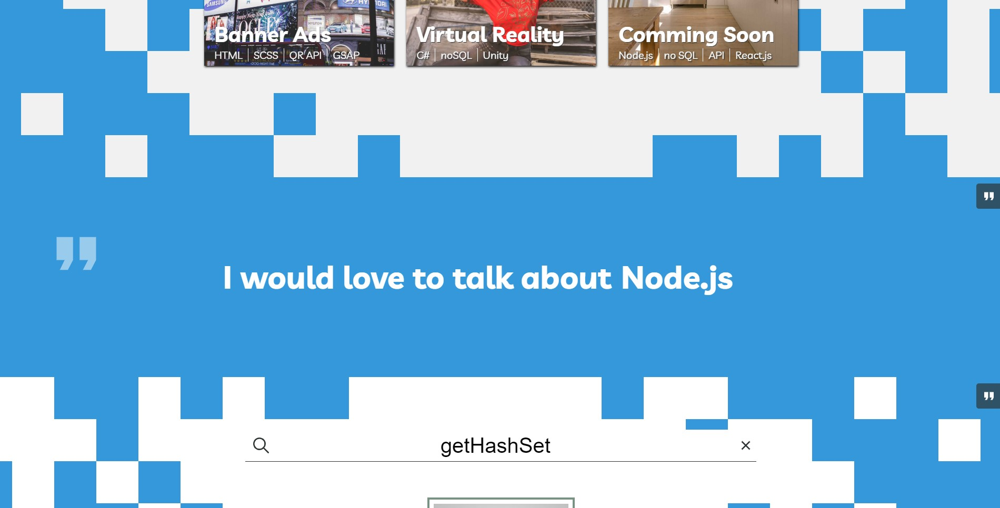
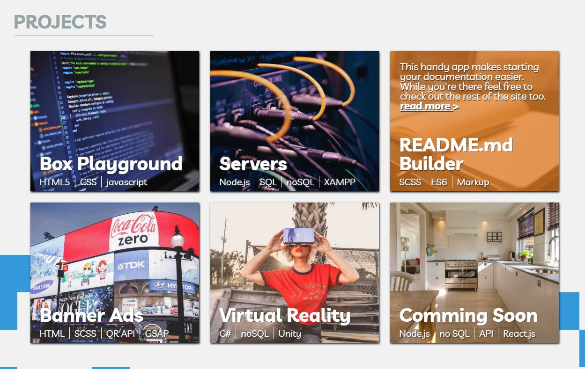
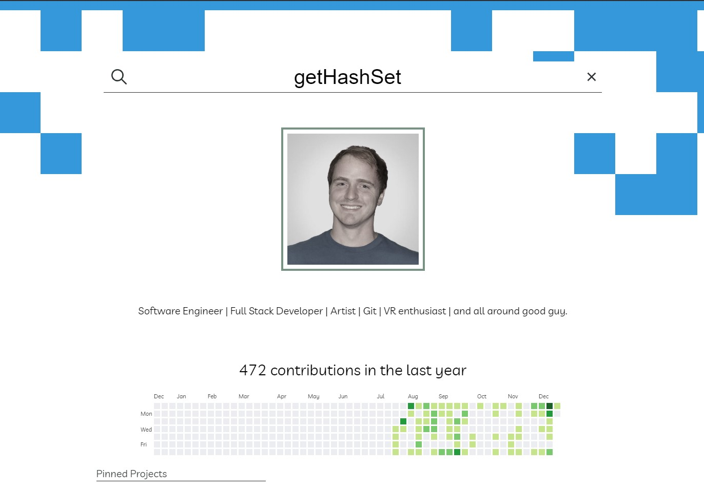
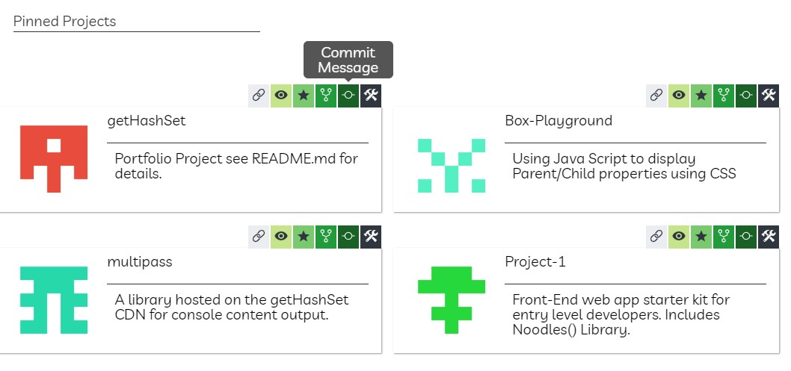
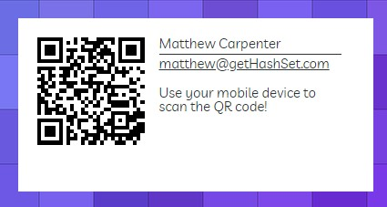
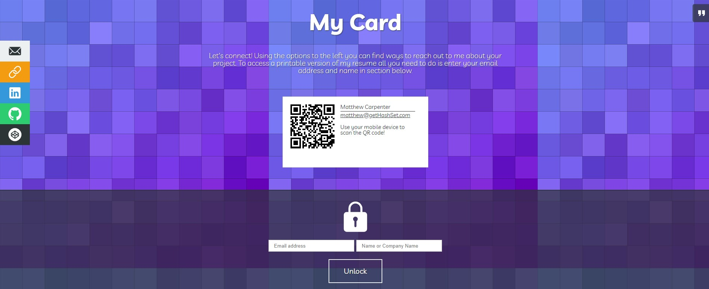
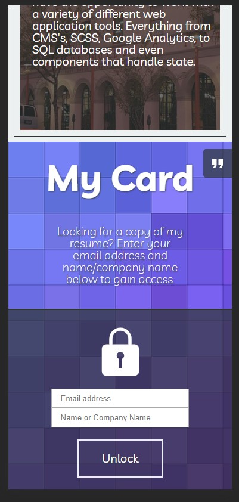
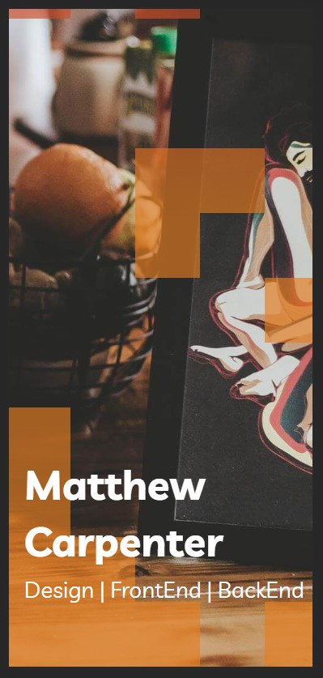
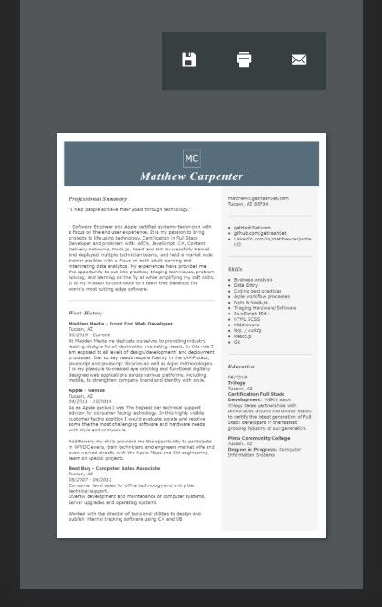
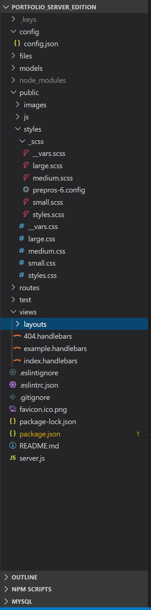

# portfolio_matthew_carpenter 
 
*Collaborators:* 
 
*by Matthew Carpenter* 
 
See the published site [here](getHashSet.com) 
 
## About 
 
Welcome to my fully interactive portfolio experience. 

This project page aids potential employment candidates through the workflow of the candidates selection process.

The user journey begins by introducing me, Matthew Carpenter, a software engineer based in the United States. 

Continue reading to discover how the site works, how data is collected and displayed, as well as some fun tricks you can discover on the home page.  
## Index 
 
[Goal](#Goal) 
 
[Hero](#Hero) 
 
[Section - Skills](#Section---Skills) 
 
[Section - Projects](#Section---Projects) 
 
[Section - Git](#Section---Git) 
 
[Section - Timeline](#Section---Timeline) 
 
[Section - Code](#Section---Code) 
 
[Section - Contact](#Section---Contact) 
 
[Section - Locked](#Section---Locked) 
 
[Easter Egg](#Easter-Egg) 
 
[More](#More) 
 
[FIN](#FIN) 
 
## Goal
---
 
My **goal**, and the purpose of this portfolio is to guide the user through these steps in hopes to aid them in discovery process. 

To do this I thought; *"What is a future employer/partner here to see?"*

I broke that question down into the following parts. (See Sections Below)

And to demonstrate my skill level in a MVC full-stack server based application. 
(See Tech used)

 
## Hero
---
 

 

This is the first imagery a user will see when the page loads. My name, title, and links to professional materials (via icons)

Comment bar is excluded from this section (See Easter Eggs)

My name rolls in one letter at a time *(some edge cases remaining depending on size but are being addressed in the next update to add a span to each word.)*
 
## Section - Skills
---


 

In this section of the portfolio there is text that displays typing out a list of skills I would love to talk about. 

“Quote”: clicking the quote section will display the brand logos on a grid using flexbox. 
 
## Section - Projects
---


 

Projects is loaded in from a mySQL database and displayed as cards on the home page. 

These projects demonstrate some of my favorite technical abilities and are great talking points. (Max of 6)

“Quote”: I describe the process of loading from mySQL to the dom.
 
## Section - Git
---


 
 
The first thing I thought about, and likely other developers think about, is how to get someone to our GitHub page. That’s where all my favorite projects are and the skill trajectory can be mapped out to better assess skills. 

What better way to do that than with a full web application. This section pulls data from the GitHub API and returns a function object of data that can be parsed for relevant data. But that wasn’t enough. My server side application uses the npm packages, axios, and cheerio to pull additional information from the API data that’s not available using the non-OAth request and scrapes for the UI calendar that looks so magnificent on the user home page. 

Using this collected data the section is built. 

 

The initial page load is from a cached pull that the server makes once a week (handling null values and edge cases to prevent issues for storing in the noSQL database.)

But wait, theirs more!

Any visitor to the web application can enter a GitHub user name and it will display their information in the same way live on screen. (With some hidden bells and whistles for users who have filled out optional fields in github)

Give it a shot by clicking (here)[#] 

 
## Section - Timeline
---
 
This section will display my work history using a timeline and animations.

**(this section was cut for time.)**
 
## Section - Code
---
 


This section of the web application will display README.md, html, scss, JavaScript coding practices as well as a few example pieces with links to the projects to see the code live. 

It was added to every section on the right hand side. As you enter the section it will glide in and you can select it to see a quick peek at the ```README.md```
 
## Section - Contact
---
 
 Feel free to check out any of the code you may come across. I have devided the javascript file into multiple sections *(not something I would normally do for any of the thematic or same page scripts.)*, but this will make it easier for other students or curious onlookers to parse through my code.

 Some examples:

 
 
 

This section produces a business card containing a QR link to my professional materials. Each business card is color coded and displays a QR code scannable by any smart device. 

This section also produces a get in touch field entry for users who would like to start a conversation (but who really does that?)
 
## Section - Locked
---
 
 
 

The locked section will allow any user that validates their email and name to gain access to my *filtered* resume.

Once the email is valid using RegEx the next section displays a print download and email option for my resume.

This section also updates it's content to be mobile friendly. No need to scan a QR code if you're already on your phone.

 

 **Next Step:** Add a slide in email icon for quick access to email me about your project.
 
## Easter Egg
---
 
Using an npm package and some custom classes you can use ```Konami Code``` to access developer mode from anywhere on the site. 

This will produce a drop down menu and edit tools on all sections. You can edit all the sections you would like, but without the user name and password of an admin the site will not save to the database.

This tool acts as a CMS for... well me of course! This means I can update my website from any computer without having to access the code. Handy right?
 
## More
---
 
This site is mobile friendly! That doesnt mean I found *every edge case* but it is a comfortable application to use on any handheld device.





Even the resume section has been preped so that you may view the content on the go.




This site also uses **MVC** *(Model View Controller )* standards. Feel free to check out the code.

 

## Coming soon
---

Currently the mySQL database has been taken down to update its schema. Because of this the konami code will function to bring down content windows but they will not respond to the user. Those scripts for the API calls have also been taken down. (12-09-2019) and should be up in the new year.
 
## FIN
 
Thank you for visiting my README. Now visit the (site)[gethashset.com]
 

 [Back to top](#)
